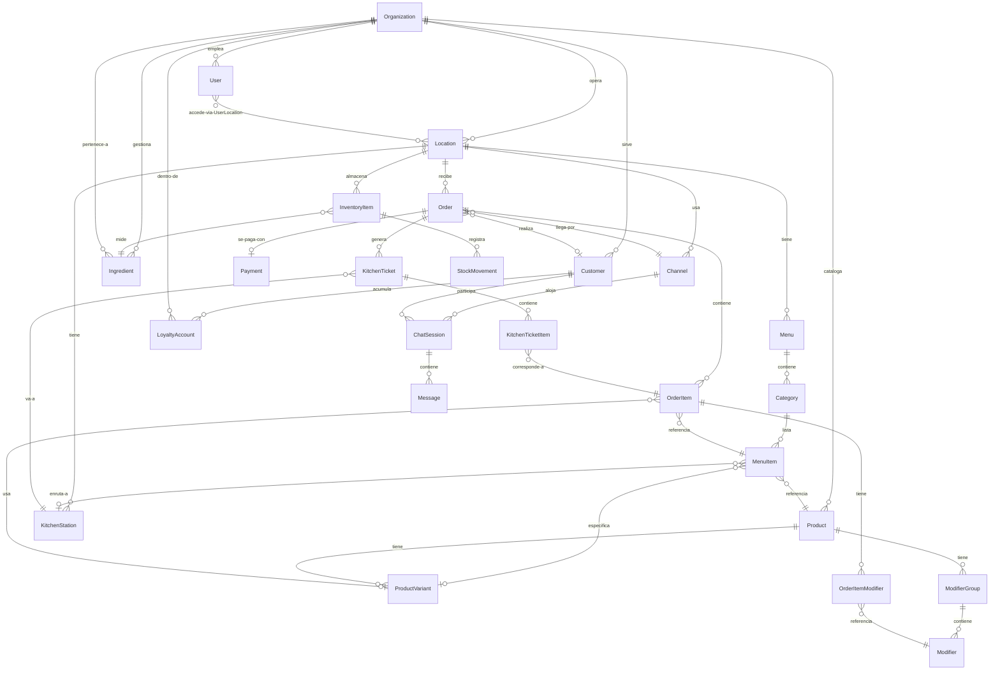

# Modelo de Dominio — SATEM Food Engine

> **Documento de arquitectura — Fase 2**  
> Autor: Software Architect · Fecha: 2026-07  
> Estado: ✅ **Aprobado — v1.0** · `prisma/schema.prisma` generado y validado.

---

## Changelog

| Versión | Fecha   | Cambios                                                                                                                                                                                                                                                                                                            |
| ------- | ------- | ------------------------------------------------------------------------------------------------------------------------------------------------------------------------------------------------------------------------------------------------------------------------------------------------------------------ |
| v1.0    | 2026-07 | Aprobación. ProductVariant como entidad intermedia Product→MenuItem; Inventory incluido desde inicio; Channel con ChannelType enum (sin webhookUrl); ChatSession→ChannelSession; KitchenStation diferida a Fase 3; soft-delete (deletedAt) en entidades persistentes; CUID estándar; enums para todos los estados. |
| v0.1    | 2026-07 | Borrador inicial para revisión.                                                                                                                                                                                                                                                                                    |

---

## Contexto y Alcance

SATEM Food Engine es una plataforma SaaS **multi-tenant** para la industria alimentaria. Un _tenant_ es una organización (marca, empresa o emprendedor) que puede operar uno o múltiples locales de distintos tipos:

| Tipo de local | Particularidades                                         |
| ------------- | -------------------------------------------------------- |
| Restaurante   | Comedor, mesas, pedidos en sala y para llevar            |
| Cafetería     | Mostrador, pedidos rápidos, alta rotación                |
| Food Truck    | Sin dirección fija, menú reducido, alto volumen          |
| Dark Kitchen  | Sin atención al público, solo delivery, múltiples marcas |

El modelo debe acomodar estas variantes **sin bifurcar el schema** — distintos tipos de local comparten las mismas entidades con configuración diferente.

---

## 1. Módulos del Sistema

El dominio se organiza en **9 módulos** con responsabilidades claramente separadas:

| #   | Módulo        | Responsabilidad principal                                                |
| --- | ------------- | ------------------------------------------------------------------------ |
| 1   | **Tenancy**   | Gestión de organizaciones y locales (multi-tenant, multi-branch)         |
| 2   | **Catalog**   | Catálogo de productos, variantes, menús y modificadores                  |
| 3   | **Ordering**  | Ciclo de vida completo de un pedido                                      |
| 4   | **Payments**  | Transacciones de pago y su estado                                        |
| 5   | **Kitchen**   | Comandas a cocina (punto único en Fase 2; estaciones en Fase 3)          |
| 6   | **Inventory** | Control de stock e ingredientes (schema listo; servicios en Fase futura) |
| 7   | **Customers** | Clientes, historial y fidelización                                       |
| 8   | **Channels**  | Canales de venta (ChannelType enum) y sesiones de chatbot                |
| 9   | **Staff**     | Usuarios del sistema, roles y permisos                                   |

---

## 2. Entidades

### Módulo 1 — Tenancy

#### `Organization`

La unidad raíz del sistema. Representa al tenant completo: la empresa, la marca o el emprendedor dueño del sistema.

| Campo           | Tipo      | Descripción                                  |
| --------------- | --------- | -------------------------------------------- |
| `id`            | UUID      | Identificador único                          |
| `slug`          | String    | Identificador URL-friendly único globalmente |
| `name`          | String    | Nombre comercial                             |
| `legalName`     | String?   | Razón social                                 |
| `taxId`         | String?   | RUT o equivalente                            |
| `logoUrl`       | String?   | Logotipo                                     |
| `plan`          | Enum      | `free \| starter \| pro \| enterprise`       |
| `planExpiresAt` | DateTime? | Expiración del plan de pago                  |
| `isActive`      | Boolean   | Permite suspender tenants sin borrar datos   |
| `createdAt`     | DateTime  |                                              |
| `updatedAt`     | DateTime  |                                              |

**Responsabilidad:** Es el límite de aislamiento del tenant. Todo el resto del dominio cuelga de `Organization`. Controla el acceso por plan de suscripción.

---

#### `Location`

Un local operativo. Puede ser físico (restaurante, food truck) o virtual (dark kitchen, solo delivery).

| Campo            | Tipo     | Descripción                                                 |
| ---------------- | -------- | ----------------------------------------------------------- |
| `id`             | UUID     |                                                             |
| `organizationId` | UUID     | FK → Organization                                           |
| `name`           | String   | Ej: "Sucursal Las Condes", "Food Truck #2"                  |
| `type`           | Enum     | `restaurant \| cafeteria \| food_truck \| dark_kitchen`     |
| `slug`           | String   | Único dentro de la organización                             |
| `address`        | String?  | Dirección física (null para food trucks itinerantes)        |
| `city`           | String?  |                                                             |
| `country`        | String   | ISO 3166-1 alpha-2                                          |
| `timezone`       | String   | IANA tz: "America/Santiago"                                 |
| `phone`          | String?  |                                                             |
| `currency`       | String   | ISO 4217: "CLP", "USD"                                      |
| `taxRate`        | Decimal  | Porcentaje de IVA aplicado en esta ubicación                |
| `isActive`       | Boolean  |                                                             |
| `operatingHours` | JSON     | Horarios por día de la semana                               |
| `settings`       | JSON     | Config específica: tabla/mostrador, propina, delivery, etc. |
| `createdAt`      | DateTime |                                                             |
| `updatedAt`      | DateTime |                                                             |

**Responsabilidad:** Es la unidad operativa primaria. Orders, Menus, KitchenStations e Inventory están **todos scoped a Location**. Esto habilita operaciones multi-sucursal genuinas.

---

### Módulo 2 — Catalog

#### `Product`

El ítem vendible canónico. Existe al nivel de **Organization** (catálogo global compartido entre locales).

| Campo            | Tipo     | Descripción                                       |
| ---------------- | -------- | ------------------------------------------------- |
| `id`             | UUID     |                                                   |
| `organizationId` | UUID     | FK → Organization                                 |
| `sku`            | String?  | Código interno del producto                       |
| `name`           | String   | Nombre canónico                                   |
| `description`    | String?  |                                                   |
| `imageUrl`       | String?  |                                                   |
| `basePrice`      | Decimal  | Precio base (puede ser sobreescrito por MenuItem) |
| `isAlcoholic`    | Boolean  | Para restricciones de horario                     |
| `taxCategory`    | Enum     | `standard \| exempt \| reduced`                   |
| `isActive`       | Boolean  |                                                   |
| `metadata`       | JSON     | Tags, alérgenos, información nutricional          |
| `createdAt`      | DateTime |                                                   |
| `updatedAt`      | DateTime |                                                   |

**Responsabilidad:** Define qué existe en el catálogo de la organización. No define precios por local ni disponibilidad — eso es responsabilidad de `MenuItem`.

---

#### `ProductVariant`

**Entidad intermedia** entre `Product` y `MenuItem`. Representa tamaños, versiones o configuraciones de un producto. `MenuItem` referencia `ProductVariant`, no `Product` directamente.

Cadena de catálogo: **Product → ProductVariant → MenuItem**

| Campo       | Tipo      | Descripción                                                    |
| ----------- | --------- | -------------------------------------------------------------- |
| `id`        | CUID      |                                                                |
| `productId` | CUID      | FK → Product                                                   |
| `name`      | String    | Ej: "Estándar", "Grande", "Sin azúcar", "Con papas"            |
| `sku`       | String?   | Código para esta variante específica                           |
| `isDefault` | Boolean   | Variante por defecto (cuando el Product tiene solo una opción) |
| `sortOrder` | Int       |                                                                |
| `isActive`  | Boolean   |                                                                |
| `createdAt` | DateTime  |                                                                |
| `updatedAt` | DateTime  |                                                                |
| `deletedAt` | DateTime? | Soft-delete                                                    |

**Nota:** Un Product con una sola presentación igual requiere al menos una variante (marcada como `isDefault = true`).

---

#### `ModifierGroup`

Un grupo de opciones adicionales para un producto. Ej: "Elige tu aderezo", "Extras".

| Campo         | Tipo    | Descripción                                           |
| ------------- | ------- | ----------------------------------------------------- |
| `id`          | UUID    |                                                       |
| `productId`   | UUID    | FK → Product                                          |
| `name`        | String  | Ej: "Salsas", "Puntos de cocción"                     |
| `description` | String? |                                                       |
| `minSelect`   | Int     | Mínimo de opciones a seleccionar (0 = opcional)       |
| `maxSelect`   | Int     | Máximo de opciones (1 = radio, N = checkbox múltiple) |
| `isRequired`  | Boolean | Derivado de minSelect > 0                             |
| `sortOrder`   | Int     |                                                       |

---

#### `Modifier`

Una opción individual dentro de un ModifierGroup.

| Campo             | Tipo    | Descripción                           |
| ----------------- | ------- | ------------------------------------- |
| `id`              | UUID    |                                       |
| `modifierGroupId` | UUID    | FK → ModifierGroup                    |
| `name`            | String  | Ej: "Cheddar", "BBQ", "Término medio" |
| `priceExtra`      | Decimal | Precio adicional (puede ser 0)        |
| `sortOrder`       | Int     |                                       |
| `isActive`        | Boolean |                                       |

---

#### `Menu`

Un conjunto nombrado de categorías disponible en un local. Un local puede tener múltiples menús (ej: desayuno, almuerzo, carta navideña).

| Campo         | Tipo      | Descripción                                  |
| ------------- | --------- | -------------------------------------------- |
| `id`          | UUID      |                                              |
| `locationId`  | UUID      | FK → Location                                |
| `name`        | String    | Ej: "Carta Principal", "Menú Almuerzo"       |
| `description` | String?   |                                              |
| `isDefault`   | Boolean   | El menú activo por defecto para clientes     |
| `isActive`    | Boolean   |                                              |
| `validFrom`   | DateTime? | Inicio de vigencia (para menús estacionales) |
| `validUntil`  | DateTime? | Fin de vigencia                              |
| `schedule`    | JSON?     | Disponibilidad horaria por día               |
| `createdAt`   | DateTime  |                                              |
| `updatedAt`   | DateTime  |                                              |

---

#### `Category`

Una sección dentro de un Menu. Ej: "Entradas", "Platos de fondo", "Postres".

| Campo       | Tipo    | Descripción |
| ----------- | ------- | ----------- |
| `id`        | UUID    |             |
| `menuId`    | UUID    | FK → Menu   |
| `name`      | String  |             |
| `imageUrl`  | String? |             |
| `sortOrder` | Int     |             |
| `isActive`  | Boolean |             |

---

#### `MenuItem`

**Entidad pivote.** Proyecta una `ProductVariant` en una `Category` con precio y disponibilidad específicos para ese menú y sucursal.

Cadena completa: **Organization → Product → ProductVariant → MenuItem ← Category ← Menu ← Location**

| Campo              | Tipo      | Descripción                                                   |
| ------------------ | --------- | ------------------------------------------------------------- |
| `id`               | CUID      |                                                               |
| `categoryId`       | CUID      | FK → Category                                                 |
| `productVariantId` | CUID      | FK → **ProductVariant** (no Product directamente)             |
| `name`             | String?   | Override del nombre (null = usar ProductVariant/Product.name) |
| `description`      | String?   | Override de descripción para este menú                        |
| `imageUrl`         | String?   | Override de imagen                                            |
| `price`            | Decimal   | Precio efectivo en este menú y sucursal                       |
| `isAvailable`      | Boolean   | Disponible para pedidos ahora                                 |
| `isVisible`        | Boolean   | Visible en la carta (puede estar oculto temporalmente)        |
| `sortOrder`        | Int       |                                                               |
| `createdAt`        | DateTime  |                                                               |
| `updatedAt`        | DateTime  |                                                               |
| `deletedAt`        | DateTime? | Soft-delete                                                   |

> **Nota:** `kitchenStationId` está **RESERVADO para Fase 3**. No existe en el schema actual.

**Responsabilidad:** Es el único punto donde se define el precio efectivo del pedido. Permite que la misma variante tenga precios distintos en diferentes menús o sucursales.

---

### Módulo 3 — Ordering

#### `Order`

El objeto central del sistema. Representa un pedido completo desde su creación hasta su entrega.

| Campo                | Tipo      | Descripción                                                                     |
| -------------------- | --------- | ------------------------------------------------------------------------------- |
| `id`                 | UUID      |                                                                                 |
| `orderNumber`        | String    | Número legible, secuencial por local (Ej: "#0042")                              |
| `locationId`         | UUID      | FK → Location                                                                   |
| `customerId`         | UUID?     | FK → Customer (null si es pedido de invitado)                                   |
| `channelId`          | UUID      | FK → Channel — cómo llegó el pedido                                             |
| `status`             | Enum      | `draft \| pending \| confirmed \| preparing \| ready \| delivered \| cancelled` |
| `type`               | Enum      | `dine_in \| takeaway \| delivery`                                               |
| `tableIdentifier`    | String?   | Número de mesa o identificador (para dine_in)                                   |
| `notes`              | String?   | Nota general del pedido del cliente                                             |
| `subtotal`           | Decimal   | Suma de ítems antes de impuestos y descuentos                                   |
| `taxAmount`          | Decimal   | Impuesto calculado                                                              |
| `discountAmount`     | Decimal   | Descuentos aplicados                                                            |
| `totalAmount`        | Decimal   | Total final a cobrar                                                            |
| `confirmedAt`        | DateTime? |                                                                                 |
| `preparedAt`         | DateTime? |                                                                                 |
| `deliveredAt`        | DateTime? |                                                                                 |
| `cancelledAt`        | DateTime? |                                                                                 |
| `cancellationReason` | String?   |                                                                                 |
| `metadata`           | JSON?     | Datos extra del canal (ej: messageId de WhatsApp)                               |
| `createdAt`          | DateTime  |                                                                                 |
| `updatedAt`          | DateTime  |                                                                                 |

---

#### `OrderItem`

Una línea dentro de un pedido. **Los precios y nombres se congelan en el momento del pedido** (snapshot pattern).

| Campo              | Tipo    | Descripción                                                   |
| ------------------ | ------- | ------------------------------------------------------------- |
| `id`               | UUID    |                                                               |
| `orderId`          | UUID    | FK → Order                                                    |
| `menuItemId`       | UUID    | FK → MenuItem (referencia de auditoría; no usar para precios) |
| `productVariantId` | UUID?   | FK → ProductVariant si se eligió una variante                 |
| `name`             | String  | **Snapshot** del nombre al momento del pedido                 |
| `unitPrice`        | Decimal | **Snapshot** del precio al momento del pedido                 |
| `quantity`         | Int     |                                                               |
| `subtotal`         | Decimal | unitPrice × quantity + modifiers                              |
| `notes`            | String? | Nota específica del ítem ("sin cebolla")                      |

---

#### `OrderItemModifier`

Un modificador seleccionado por el cliente para un ítem. También congelado.

| Campo         | Tipo    | Descripción                             |
| ------------- | ------- | --------------------------------------- |
| `id`          | UUID    |                                         |
| `orderItemId` | UUID    | FK → OrderItem                          |
| `modifierId`  | UUID    | FK → Modifier (referencia de auditoría) |
| `name`        | String  | **Snapshot** del nombre del modificador |
| `priceExtra`  | Decimal | **Snapshot** del precio adicional       |

---

### Módulo 4 — Payments

#### `Payment`

Una transacción de pago asociada a un Order.

| Campo               | Tipo      | Descripción                                           |
| ------------------- | --------- | ----------------------------------------------------- |
| `id`                | UUID      |                                                       |
| `orderId`           | UUID      | FK → Order (unique: un pedido, un pago activo)        |
| `provider`          | Enum      | `sumup \| stripe \| mercadopago \| cash \| transfer`  |
| `status`            | Enum      | `pending \| processing \| paid \| failed \| refunded` |
| `amount`            | Decimal   | Monto cobrado                                         |
| `currency`          | String    | ISO 4217                                              |
| `externalId`        | String?   | ID de la transacción en el proveedor externo          |
| `externalReference` | String?   | Referencia de la operación en el proveedor            |
| `paidAt`            | DateTime? |                                                       |
| `failureReason`     | String?   |                                                       |
| `receiptUrl`        | String?   | URL del comprobante del proveedor                     |
| `metadata`          | JSON?     | Respuesta raw del proveedor (para debugging)          |
| `createdAt`         | DateTime  |                                                       |
| `updatedAt`         | DateTime  |                                                       |

---

### Módulo 5 — Kitchen

> **Fase 2 — Punto único de preparación.**  
> `KitchenStation` está **diferida a Fase 3**. El diseño actual soporta un único punto de preparación por pedido. La migración para agregar estaciones será **aditiva**: se añadirá `kitchenStationId` en `KitchenTicket` y `MenuItem` sin romper este schema.

#### `KitchenTicket`

Comanda generada al confirmar un Order. En Fase 2: un Order genera un único ticket. En Fase 3: múltiples tickets por estación.

| Campo              | Tipo      | Descripción                                   |
| ------------------ | --------- | --------------------------------------------- |
| `id`               | UUID      |                                               |
| `orderId`          | UUID      | FK → Order                                    |
| `kitchenStationId` | UUID      | FK → KitchenStation                           |
| `status`           | Enum      | `pending \| in_progress \| done \| cancelled` |
| `printedAt`        | DateTime? |                                               |
| `startedAt`        | DateTime? |                                               |
| `completedAt`      | DateTime? |                                               |
| `notes`            | String?   |                                               |
| `createdAt`        | DateTime  |                                               |

---

#### `KitchenTicketItem`

Los ítems del Order asignados a una estación específica.

| Campo             | Tipo | Descripción                 |
| ----------------- | ---- | --------------------------- |
| `id`              | UUID |                             |
| `kitchenTicketId` | UUID | FK → KitchenTicket          |
| `orderItemId`     | UUID | FK → OrderItem              |
| `quantity`        | Int  | Cantidad para esta estación |

---

### Módulo 6 — Inventory

> **Nota:** Diseñado para implementación futura. No requiere migraciones disruptivas cuando se implemente.

#### `Ingredient`

| Campo            | Tipo    | Descripción                       |
| ---------------- | ------- | --------------------------------- |
| `id`             | UUID    |                                   |
| `organizationId` | UUID    | FK → Organization                 |
| `name`           | String  | Ej: "Harina 000", "Queso Cheddar" |
| `unit`           | Enum    | `kg \| g \| l \| ml \| units`     |
| `isActive`       | Boolean |                                   |

#### `InventoryItem`

| Campo          | Tipo     | Descripción                      |
| -------------- | -------- | -------------------------------- |
| `id`           | UUID     |                                  |
| `locationId`   | UUID     | FK → Location                    |
| `ingredientId` | UUID     | FK → Ingredient                  |
| `quantity`     | Decimal  | Stock actual                     |
| `minQuantity`  | Decimal  | Umbral para alerta de stock bajo |
| `updatedAt`    | DateTime |                                  |

#### `StockMovement`

| Campo             | Tipo     | Descripción                                   |
| ----------------- | -------- | --------------------------------------------- |
| `id`              | UUID     |                                               |
| `inventoryItemId` | UUID     | FK → InventoryItem                            |
| `type`            | Enum     | `purchase \| sale \| waste \| adjustment`     |
| `quantity`        | Decimal  | Delta (positivo = entrada, negativo = salida) |
| `reason`          | String?  |                                               |
| `orderId`         | UUID?    | FK → Order si fue generado por un pedido      |
| `userId`          | UUID?    | FK → User que realizó el ajuste               |
| `createdAt`       | DateTime |                                               |

---

### Módulo 7 — Customers

#### `Customer`

El consumidor final. El teléfono es el identificador de unificación cross-canal.

| Campo            | Tipo     | Descripción                                       |
| ---------------- | -------- | ------------------------------------------------- |
| `id`             | UUID     |                                                   |
| `organizationId` | UUID     | FK → Organization                                 |
| `phone`          | String?  | E.164 format. Principal identificador cross-canal |
| `email`          | String?  |                                                   |
| `name`           | String?  |                                                   |
| `avatarUrl`      | String?  |                                                   |
| `isBlocked`      | Boolean  |                                                   |
| `notes`          | String?  | Nota interna del staff                            |
| `metadata`       | JSON?    | IDs externos (ej: whatsappId, telegramId)         |
| `createdAt`      | DateTime |                                                   |
| `updatedAt`      | DateTime |                                                   |

---

#### `LoyaltyAccount`

Cuenta de fidelización, cross-location dentro de la misma organización.

| Campo            | Tipo     | Descripción                |
| ---------------- | -------- | -------------------------- |
| `id`             | UUID     |                            |
| `customerId`     | UUID     | FK → Customer              |
| `organizationId` | UUID     | FK → Organization          |
| `points`         | Int      | Puntos acumulados          |
| `totalSpent`     | Decimal  | Total gastado histórico    |
| `tier`           | Enum?    | `bronze \| silver \| gold` |
| `updatedAt`      | DateTime |                            |

---

### Módulo 8 — Channels

#### `Channel`

Canal de venta configurado para un Location. Abstrae el origen del pedido mediante `ChannelType` enum. La integración con n8n se realiza vía webhooks externos — **no está referenciada en este modelo**.

| Campo        | Tipo        | Descripción                                                                  |
| ------------ | ----------- | ---------------------------------------------------------------------------- |
| `id`         | CUID        |                                                                              |
| `locationId` | CUID        | FK → Location                                                                |
| `type`       | ChannelType | `WEB \| WHATSAPP \| TELEGRAM \| QR \| KIOSK \| INSTAGRAM \| FACEBOOK \| API` |
| `name`       | String      | Ej: "WhatsApp +56 9 1234 5678", "Carta Web"                                  |
| `isActive`   | Boolean     |                                                                              |
| `config`     | JSON        | Config específica validada con Zod: phoneNumberId, botToken, etc.            |
| `createdAt`  | DateTime    |                                                                              |
| `updatedAt`  | DateTime    |                                                                              |
| `deletedAt`  | DateTime?   | Soft-delete                                                                  |

> **Nota:** `webhookUrl` fue **eliminado** del modelo. n8n se conecta externamente. El canal solo define su tipo y configuración.

---

#### `ChannelSession` _(anteriormente ChatSession)_

Sesión de canal: conversación persistente del chatbot. Permite retomar el contexto del flujo entre mensajes. `externalId` es la clave de idempotencia contra webhooks duplicados.

| Campo        | Tipo                 | Descripción                                                     |
| ------------ | -------------------- | --------------------------------------------------------------- |
| `id`         | CUID                 |                                                                 |
| `channelId`  | CUID                 | FK → Channel                                                    |
| `customerId` | CUID?                | FK → Customer (null hasta identificación del cliente)           |
| `externalId` | String               | ID nativo del canal: WhatsApp conversation ID, Telegram chat_id |
| `status`     | ChannelSessionStatus | `ACTIVE \| RESOLVED \| ABANDONED \| EXPIRED`                    |
| `context`    | JSON?                | Estado del flujo del chatbot: { step, cart, lastIntent, ... }   |
| `startedAt`  | DateTime             |                                                                 |
| `resolvedAt` | DateTime?            |                                                                 |
| `expiresAt`  | DateTime?            | Timeout de sesión                                               |
| `createdAt`  | DateTime             |                                                                 |
| `updatedAt`  | DateTime             |                                                                 |
| `deletedAt`  | DateTime?            | Soft-delete                                                     |

---

#### `Message`

| Campo           | Tipo     | Descripción                             |
| --------------- | -------- | --------------------------------------- |
| `id`            | UUID     |                                         |
| `chatSessionId` | UUID     | FK → ChatSession                        |
| `role`          | Enum     | `user \| assistant \| system`           |
| `content`       | String   | Texto del mensaje                       |
| `type`          | Enum     | `text \| image \| interactive \| order` |
| `metadata`      | JSON?    | Payload del mensaje original del canal  |
| `createdAt`     | DateTime |                                         |

---

### Módulo 9 — Staff

#### `User`

| Campo            | Tipo      | Descripción                                       |
| ---------------- | --------- | ------------------------------------------------- |
| `id`             | UUID      |                                                   |
| `organizationId` | UUID      | FK → Organization                                 |
| `email`          | String    | Único globalmente                                 |
| `name`           | String    |                                                   |
| `avatarUrl`      | String?   |                                                   |
| `role`           | Enum      | `owner \| admin \| manager \| cashier \| kitchen` |
| `isActive`       | Boolean   |                                                   |
| `lastLoginAt`    | DateTime? |                                                   |
| `createdAt`      | DateTime  |                                                   |

---

#### `UserLocation`

Tabla de acceso: qué locales puede ver/operar cada usuario.

| Campo        | Tipo     | Descripción   |
| ------------ | -------- | ------------- |
| `userId`     | UUID     | FK → User     |
| `locationId` | UUID     | FK → Location |
| `grantedAt`  | DateTime |               |

**Clave compuesta:** `(userId, locationId)`

---

## 3. Responsabilidad de Cada Entidad (Resumen)

| Entidad             | Responde a la pregunta...                                       |
| ------------------- | --------------------------------------------------------------- |
| `Organization`      | ¿A qué tenant pertenecen estos datos?                           |
| `Location`          | ¿En qué local ocurrió esto?                                     |
| `Product`           | ¿Qué puede vender esta organización?                            |
| `ProductVariant`    | ¿En qué variantes se vende este producto?                       |
| `ModifierGroup`     | ¿Qué grupos de opciones tiene este producto?                    |
| `Modifier`          | ¿Cuáles son las opciones individuales de cada grupo?            |
| `Menu`              | ¿Qué carta tiene activa este local?                             |
| `Category`          | ¿Cómo se agrupan los productos en esta carta?                   |
| `MenuItem`          | ¿A qué precio y disponibilidad está este producto en este menú? |
| `Order`             | ¿Qué pidió el cliente y en qué estado está?                     |
| `OrderItem`         | ¿Qué exactamente pidió (precio congelado)?                      |
| `OrderItemModifier` | ¿Con qué extras o modificaciones?                               |
| `Payment`           | ¿El pedido fue pagado, cómo y por cuánto?                       |
| `KitchenStation`    | ¿Quién prepara cada ítem?                                       |
| `KitchenTicket`     | ¿Qué necesita preparar esta estación ahora?                     |
| `KitchenTicketItem` | ¿Cuántas unidades de qué ítem?                                  |
| `Ingredient`        | ¿Qué insumos usa esta organización?                             |
| `InventoryItem`     | ¿Cuánto stock hay en este local?                                |
| `StockMovement`     | ¿Por qué cambió el stock?                                       |
| `Customer`          | ¿Quién hizo este pedido?                                        |
| `LoyaltyAccount`    | ¿Cuántos puntos tiene este cliente con esta marca?              |
| `Channel`           | ¿Por qué medio llegan los pedidos?                              |
| `ChatSession`       | ¿Qué conversación originó este pedido?                          |
| `Message`           | ¿Qué se dijo en la conversación?                                |
| `User`              | ¿Quién opera el sistema?                                        |
| `UserLocation`      | ¿A qué locales tiene acceso este usuario?                       |

---

## 4. Relaciones Entre Entidades

### Tenancy

```
Organization (1) ──── (N) Location
Organization (1) ──── (N) Product
Organization (1) ──── (N) User
Organization (1) ──── (N) Customer
Organization (1) ──── (N) Ingredient
```

### Catalog

```
Location      (1) ──── (N) Menu
Menu          (1) ──── (N) Category
Category      (1) ──── (N) MenuItem
MenuItem      (N) ──── (1) Product           [catálogo global]
MenuItem      (N) ──── (1) ProductVariant?
MenuItem      (N) ──── (1) KitchenStation?   [routing de comanda]
Product       (1) ──── (N) ProductVariant
Product       (1) ──── (N) ModifierGroup
ModifierGroup (1) ──── (N) Modifier
```

### Ordering

```
Location          (1) ──── (N) Order
Order             (N) ──── (1) Customer?
Order             (N) ──── (1) Channel
Order             (1) ──── (N) OrderItem
Order             (1) ──── (1) Payment?
OrderItem         (N) ──── (1) MenuItem
OrderItem         (N) ──── (1) ProductVariant?
OrderItem         (1) ──── (N) OrderItemModifier
OrderItemModifier (N) ──── (1) Modifier
```

### Kitchen

```
Location           (1) ──── (N) KitchenStation
Order              (1) ──── (N) KitchenTicket
KitchenTicket      (N) ──── (1) KitchenStation
KitchenTicket      (1) ──── (N) KitchenTicketItem
KitchenTicketItem  (N) ──── (1) OrderItem
```

### Customers & Channels

```
Customer       (1) ──── (N) LoyaltyAccount
LoyaltyAccount (N) ──── (1) Organization
Location       (1) ──── (N) Channel
Channel        (1) ──── (N) ChatSession
Customer       (1) ──── (N) ChatSession
ChatSession    (1) ──── (N) Message
```

### Staff

```
Organization (1) ──── (N) User
User         (N) ──── (N) Location  [vía UserLocation]
```

---

## 5. Diagrama Mermaid ER



---

## 6. Recomendaciones de Diseño

### R1 — Snapshot Pattern en OrderItems _(CRÍTICA)_

**Problema:** Si los precios cambian, las órdenes históricas mostrarían importes incorrectos.

**Solución:** `OrderItem` y `OrderItemModifier` congelan `name` y `price` en el momento del pedido. Las FKs a `MenuItem`/`Modifier` se conservan solo para trazabilidad, nunca para recalcular precios.

**Impacto:** Los reportes históricos siempre son correctos. Cambios de precios no tienen efecto retroactivo.

---

### R2 — Product (global) vs. MenuItem (local)

**Problema:** Un restaurante con 3 sucursales necesita el mismo producto a precios distintos por local.

**Solución:** `Product` existe al nivel de `Organization`. `MenuItem` es la proyección de ese producto en un menú específico, con precio y disponibilidad propios.

**Alternativa descartada:** Duplicar Product por sucursal — genera desincronización de nombres e imágenes entre locales.

---

### R3 — Channel como abstracción de origen de pedido

**Problema:** Web, WhatsApp, Telegram y POS tienen APIs distintas pero el flujo de pedido es el mismo.

**Solución:** `Channel` abstrae el origen con `type` enum y `config` JSON para detalles específicos. Agregar un canal nuevo (ej: Uber Eats) no requiere cambios de schema.

**Impacto:** `Order.channelId` habilita analytics por canal. El routing a n8n se configura en `Channel.webhookUrl`.

---

### R4 — KitchenStation routing en MenuItem

**Problema:** Parrilla, bebidas y pastelería deben recibir solo sus ítems, no todos los del pedido.

**Solución:** `MenuItem.kitchenStationId` asigna la estación en la configuración del menú. Al confirmar un Order, se generan `KitchenTicket`s separados por estación, cada uno con sus `KitchenTicketItem`s.

---

### R5 — Customer opcional en Order (Guest Checkout)

**Problema:** Pedidos via QR en mesa pueden iniciarse antes de identificar al cliente.

**Solución:** `Order.customerId` es nullable. El Customer se vincula retroactivamente cuando provee su teléfono/email. Soporta fidelización post-pedido.

---

### R6 — LoyaltyAccount es por Organization, no por Location

**Problema:** Si un cliente va a distintas sucursales, sus puntos deben acumularse juntos.

**Solución:** `LoyaltyAccount` relaciona `Customer ↔ Organization`. Los puntos son cross-location dentro del mismo tenant.

---

### R7 — UserLocation para acceso granular multi-sucursal

**Problema:** Un cajero del local A no debe ver los pedidos del local B.

**Solución:** Tabla `UserLocation` como many-to-many. Owners acceden a todos. Managers/Cashiers solo a locales asignados.

---

### R8 — JSON controlado para settings y config

**Problema:** Cada tipo de local y canal tiene configuraciones impredecibles.

**Solución:** Campos `JSON` en `Location.settings`, `Location.operatingHours`, `Channel.config`. **Siempre validados con Zod en la capa de servicio**. Nunca insertados directamente desde input del usuario.

---

## 7. Riesgos Futuros

### Riesgo 1 — Escalabilidad con DB compartida entre tenants

**Probabilidad:** Media (relevante superando 100+ tenants activos con alto volumen).

**Síntoma:** "Noisy neighbor" — un tenant con alta carga afecta al resto.

**Mitigaciones:**

- Índices compuestos en `(organizationId, status, createdAt)` en todas las tablas principales.
- Particionamiento de `Order`, `Message` y `StockMovement` por `createdAt` en PostgreSQL.
- Preparar migración a Citus o Neon Serverless si el volumen lo exige. El diseño actual no asume nada del motor de DB, la migración sería no-disruptiva.

---

### Riesgo 2 — N+1 queries en catálogo profundamente anidado

**Descripción:** La cadena `Menu → Category → MenuItem → Product → ModifierGroup → Modifier` tiene 5 niveles. Una query naive genera N+1 problemas.

**Mitigaciones:**

- Endpoint dedicado `GET /api/menu/[locationId]` que carga el menú completo en una sola query con `include` selectivo de Prisma.
- Cachear la respuesta del menú (cambia raramente). Redis o Next.js `unstable_cache`.

---

### Riesgo 3 — Consistencia atómica Order + KitchenTickets

**Descripción:** Si un Order se cancela después de generar KitchenTickets, ambas entidades deben actualizarse atómicamente.

**Mitigación:** Usar `prisma.$transaction()` para toda operación que afecte Order + KitchenTickets simultáneamente. Definir reglas de negocio explícitas sobre en qué estados del Order se pueden cancelar tickets.

---

### Riesgo 4 — Deduplicación de webhooks de canales externos

**Descripción:** WhatsApp Cloud API y Telegram reenvían webhooks si el servidor no responde en tiempo.

**Mitigación:**

- `ChatSession.externalId` + `Message.metadata.externalMessageId` como claves de idempotencia.
- El Route Handler que recibe webhooks responde `200 OK` inmediatamente y delega el procesamiento a n8n.

---

### Riesgo 5 — Precios con IVA variable y multi-moneda

**Descripción:** Chile: IVA 19%, pero algunos productos exentos. Otros países tienen tasas distintas.

**Mitigación:**

- `Location.taxRate` por local (ya diseñado).
- `Product.taxCategory` para exenciones futuras.
- **Todos los montos en `Decimal(10,2)`** — nunca `Float` (errores de representación binaria).
- Lógica de cálculo de IVA exclusivamente en `services/payments/`.

---

### Riesgo 6 — Crecimiento de StockMovement con alto volumen

**Descripción:** Cada pedido genera múltiples movimientos. A 1000 órdenes/día × 5 ítems = 5000 registros/día.

**Mitigación:**

- Particionamiento mensual de `StockMovement`.
- Proceso de "snapshot diario" del inventario para no recalcular desde el origen.
- Considerar una tabla separada o cola de eventos para inventario en alta escala.

---

## 8. Justificación de Decisiones Arquitectónicas

### Decisión A — UUID como PK

**Justificación:** Multi-tenant + potencial multi-región. UUIDs son generables sin consultar la DB, no predecibles (seguridad), y no crean conflictos en merges de datos entre entornos.

**Trade-off aceptado:** 16 bytes vs. 4-8 de un integer. Impacto negligible en el volumen proyectado.

---

### Decisión B — `orderNumber` legible separado del UUID

**Justificación:** La cocina y el cajero necesitan comunicarse con un número corto ("mesa 4, pedido 42"). El UUID es inusable verbalmente. `orderNumber` es secuencial por Location, generado en la capa de servicio.

---

### Decisión C — Decimal, nunca Float para montos

**Justificación:** `Float` tiene errores de representación binaria (ej: `99.99999999998`). Prisma + PostgreSQL `Decimal` es de precisión exacta. No negociable en un sistema financiero.

---

### Decisión D — `metadata: JSON` en entidades clave

**Justificación:** Order, Customer, Channel y Message necesitan almacenar información específica de canal que no puede predefinirse. El campo JSON permite esto sin nuevas migraciones. **Siempre validado con Zod en la capa de servicio.**

**Trade-off:** JSON no se filtra eficientemente sin índices GIN. Solo se usa para almacenamiento, no para filtros frecuentes.

---

### Decisión E — n8n como bus de eventos, no parte del schema

**Justificación:** n8n orquesta integraciones externas (WhatsApp, Telegram, alertas). El schema de DB no referencia n8n. La comunicación es vía HTTP webhooks configurados en `Channel.webhookUrl`. Esto desacopla completamente automatización de persistencia. Si n8n se reemplaza por otro sistema, el schema no cambia.

---

### Decisión F — `isActive` en lugar de soft-delete global

**Justificación:** El soft-delete (`deletedAt`) añade complejidad a todas las queries (WHERE deletedAt IS NULL). Para esta fase, `isActive: Boolean` en entidades que se desactivan (Product, Location, Channel) es suficiente y más simple. Orders y Payments nunca se borran — solo se cancelan mediante status.

---

## Resumen de Módulos y Entidades

| Módulo    | Entidades                                                                  | Total  |
| --------- | -------------------------------------------------------------------------- | ------ |
| Tenancy   | Organization, Location                                                     | 2      |
| Catalog   | Product, ProductVariant, ModifierGroup, Modifier, Menu, Category, MenuItem | 7      |
| Ordering  | Order, OrderItem, OrderItemModifier                                        | 3      |
| Payments  | Payment                                                                    | 1      |
| Kitchen   | KitchenStation, KitchenTicket, KitchenTicketItem                           | 3      |
| Inventory | Ingredient, InventoryItem, StockMovement                                   | 3      |
| Customers | Customer, LoyaltyAccount                                                   | 2      |
| Channels  | Channel, ChatSession, Message                                              | 3      |
| Staff     | User, UserLocation                                                         | 2      |
| **Total** |                                                                            | **26** |

---

> ⏸️ **Documento completo. Esperando aprobación antes de generar `prisma/schema.prisma`.**
