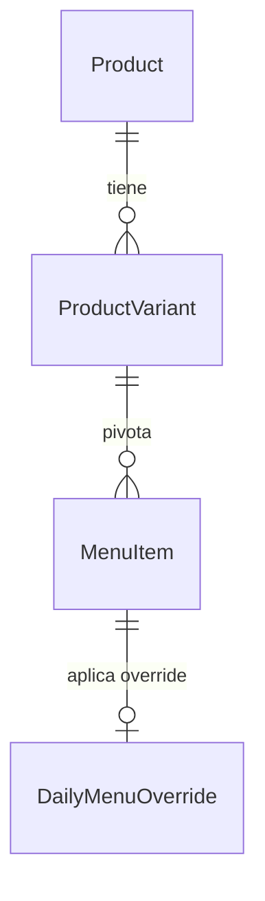
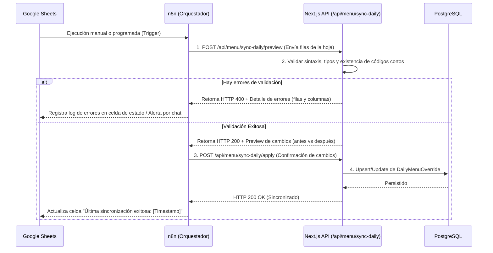

# Sincronización de Menú Operacional — CMS Google Sheets (MCI Santiago)

Este documento detalla el diseño de la sincronización diaria del menú operativo para el piloto **MCI Santiago** (Misión Carismática Internacional Santiago) mediante **Google Sheets** y **n8n**, resguardando la integridad de la base de datos **PostgreSQL** y los principios de **Clean Architecture** de SATEM Food Engine.

---

## 1. Concepto y Filosofía de Diseño

Para facilitar la administración del casino de **MCI Santiago** por parte de personal no técnico, se habilita una hoja de cálculo en Google Sheets como panel de control diario.

### Principios Fundacionales:

1. **PostgreSQL es la Única Fuente de Verdad:** Google Sheets no almacena el estado persistente oficial de la aplicación. Es una interfaz de captura de datos operacionales diarios.
2. **Desacoplamiento Absoluto:** La aplicación Next.js nunca lee la API de Google Sheets directamente. Toda la lectura se realiza sobre PostgreSQL.
3. **No Inserción/Eliminación:** Google Sheets **nunca** creará ni eliminará productos, categorías, variantes o modificadores. Su único objetivo es modificar temporalmente el comportamiento diario del catálogo existente.
4. **Ocultamiento de IDs Técnicos:** Los usuarios finales no interactúan con identificadores CUID o UUID. Toda referencia humana se realiza mediante **Códigos Cortos** estables y legibles (ej: `BUR001`, `PAP001`).

---

## 2. Datos Maestros vs. Datos Operacionales

El catálogo se divide estrictamente en dos naturalezas de información:

### Datos Maestros (Controlados en SATEM DB)

Permanecen estables y solo cambian mediante el panel administrativo de SATEM o la carga inicial de catálogo:

- Nombre base del producto, descripciones y fotografías.
- Estructura de categorías (ej. "Almuerzos", "Bebidas").
- Definición de variantes y grupos de modificadores (ej. "Con Ensalada", "Sin Cebolla").

### Datos Operacionales (Controlados en Google Sheets)

Dinámicos, mutables y con vigencia diaria para **MCI Santiago**:

- **Disponibilidad:** Si el plato está disponible hoy para la venta.
- **Precio Diario:** El valor efectivo de venta al público hoy (ej. el menú del día tiene un precio especial).
- **Stock Diario:** Cantidad de porciones/unidades preparadas para el día (control de agotamiento).
- **Visibilidad:** Si el producto se muestra o se oculta hoy de la carta digital.
- **Orden Visual:** El orden del producto dentro de su categoría para el día.
- **Destacado:** Si el producto debe resaltar visualmente en la carta digital hoy.
- **Nota Operativa:** Comentario corto y visible para el usuario (ej. "¡Recomendado del Chef!").

---

## 3. Entidad DailyMenuOverride (Catálogo Efectivo)

Para no alterar los datos maestros en la tabla `menu_items`, se introduce la entidad intermedia `DailyMenuOverride`.

### Relación de Modelos

### Comportamiento del Override y Fallback Automático

Cuando el catálogo solicita renderizar el menú, realiza una resolución dinámica (_Left Join_) entre `MenuItem` y `DailyMenuOverride`:

$$\text{Precio Efectivo} = \text{DailyMenuOverride.price} \lor \text{MenuItem.price}$$
$$\text{Disponibilidad Efectiva} = \text{DailyMenuOverride.isAvailable} \lor \text{MenuItem.isAvailable}$$

Si no existe un registro en `DailyMenuOverride` para un determinado `MenuItem` (o el servicio de sincronización falló temporalmente), **el sistema realiza un fallback automático e inmediato a los datos maestros del `MenuItem`**. Esto garantiza la continuidad operativa del restaurante en cualquier escenario.

---

## 4. Códigos Cortos vs. IDs Técnicos

Siguiendo la regla de no exponer IDs técnicos a personas:

- Cada `ProductVariant` y `MenuItem` tiene asignado un **código corto único** y alfanumérico (ej: `COM001` para Plato de Comida 1, `PAP001` para Papas Fritas, `BEB002` para Bebida Lata).
- Este código actúa como la clave de emparejamiento entre la fila de Google Sheets y el registro en PostgreSQL.
- Los IDs técnicos (CUIDs generados por Prisma) quedan confinados al motor de persistencia relacional.

---

## 5. Estructura de Google Sheets

El libro de cálculo compartido con los operadores de **MCI Santiago** consta de **dos hojas**:

### Hoja 1: `Configuración` (Solo Lectura)

Sirve como referencia rápida para el operador sobre los productos configurados en el sistema. **No es editable**.

| Columna       | Tipo    | Descripción                                                      |
| ------------- | ------- | ---------------------------------------------------------------- |
| `Código`      | Texto   | Código corto único del producto (ej. `BUR001`). Clave principal. |
| `Nombre`      | Texto   | Nombre de referencia del producto en el catálogo.                |
| `Categoría`   | Texto   | Nombre de la categoría a la que pertenece.                       |
| `Precio Base` | Decimal | Precio base maestro del producto.                                |

### Hoja 2: `Menú Diario` (Editable)

Única hoja que el operador modifica diariamente para controlar el flujo de ventas.

| Columna      | Tipo / Valores         | Descripción                                                                             |
| ------------ | ---------------------- | --------------------------------------------------------------------------------------- |
| `Código`     | Texto                  | Código corto del producto (ej. `BUR001`). **No editable**.                              |
| `Disponible` | Booleano (`SI` / `NO`) | Si está habilitada la venta del plato en el día.                                        |
| `Visible`    | Booleano (`SI` / `NO`) | Si el plato se muestra en la carta (puede estar disponible pero oculto).                |
| `Precio`     | Decimal / Vacío        | Precio para hoy. Si se deja vacío, aplica el `Precio Base`.                             |
| `Stock`      | Entero >= 0            | Cantidad de porciones hoy. Al venderse, decrementa; al llegar a 0 pasa a no disponible. |
| `Destacado`  | Booleano (`SI` / `NO`) | Si se muestra de forma prioritaria/destacada hoy.                                       |
| `Orden`      | Entero                 | Orden visual dentro de su categoría hoy (ej. 1, 2, 3).                                  |
| `Nota`       | Texto / Vacío          | Comentario diario informativo (ej. "¡Sopaipillas de cortesía!").                        |

---

## 6. Flujo de Sincronización (n8n & API)

Para garantizar consistencia, el flujo no realiza escrituras directas. Implementa un proceso estructurado de **Validación -> Preview -> Apply**:

---

## 7. Validaciones Estrictas

Antes de realizar el `apply` y guardar en PostgreSQL, la capa de servicios del dominio ejecuta las siguientes reglas sobre el payload recibido:

- **Existencia de Código:** El código debe existir en la tabla de productos/variantes. Si se envía un código como `BUR999` que no está registrado, se rechaza la sincronización.
- **Precio no Negativo:** Si la columna `Precio` no está vacía, debe ser un valor decimal mayor que 0.
- **Stock no Negativo:** Si la columna `Stock` tiene valor, debe ser un entero mayor o igual a 0.
- **Formato Booleano:** Las columnas `Disponible`, `Visible` y `Destacado` solo aceptan los textos estandarizados `SI` o `NO` (que el parser convierte a booleanos).

Cualquier falla en una sola de las filas **cancela la sincronización completa (operación atómica o rollback lógico)** para evitar dejar la carta en un estado parcialmente inconsistente. El error es detallado fila por fila para que el operador de **MCI Santiago** lo corrija en Google Sheets.

---

## 8. Reglas Operacionales de Negocio

### Control de Pedidos en OrderService

Cuando se inicia un pedido, `OrderService` consulta el estado efectivo:

- Si el producto tiene `isAvailable: false` debido a un override, el servicio de pedidos arroja un `ValidationError` y detiene la creación.
- Si el stock configurado en `DailyMenuOverride` es menor que la cantidad solicitada en el pedido, la transacción es rechazada por falta de inventario diario.

### Resguardo Histórico (Snapshot)

Una vez confirmado un pedido, los precios y nombres se congelan en la comanda (`OrderItem` y `OrderItemModifier`). Modificaciones posteriores en el Google Sheet o sincronizaciones en caliente durante el servicio **nunca alteran los montos de pedidos ya registrados o en curso**.

---

## 9. Idempotencia y Resiliencia

- **Idempotencia:** Múltiples ejecuciones del webhook de n8n con los mismos datos del Google Sheet producen exactamente el mismo estado en PostgreSQL, evitando duplicar registros o regenerar IDs.
- **Resiliencia Operativa:** Los errores de red, fallos en la API de Google, o errores temporales de n8n **nunca detienen el funcionamiento de la carta digital de MCI Santiago**, la cual sigue sirviendo los últimos datos operacionales correctamente guardados en la base de datos o cayendo de vuelta a los valores maestros en el peor de los casos.
