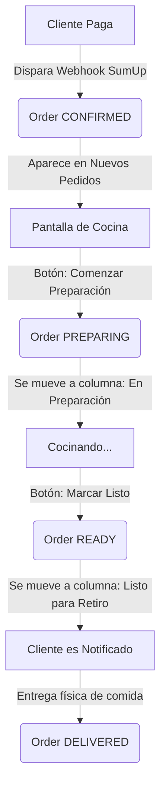

# Panel de Cocina — Diseño Operativo y Técnico

> **Documento de Arquitectura y Operación — Fase 6**  
> Autor: Software Architect · Fecha: 2026-07  
> Estado: ✅ **Aprobado**

---

## 1. Flujo Operativo en Cocina

El Kitchen Dashboard es la herramienta visual táctil utilizada en la estación de preparación del restaurante. Sigue un patrón de trabajo **FIFO (First In, First Out)** para asegurar que los pedidos se cocinen en el orden correcto de llegada.

### Reglas del Tablero Kanban:

1. **Nuevos Pedidos (`CONFIRMED`):**
   - Corresponde a los pedidos pagados que no han entrado a la plancha/preparación.
   - Acción: **Comenzar Preparación** (cambia estado a `PREPARING`).
2. **En Preparación (`PREPARING`):**
   - Pedidos que se están cocinando activamente.
   - Acción: **Marcar Listo** (cambia estado a `READY` y registra la hora de término de preparación).
3. **Listos (`READY`):**
   - Pedidos listos en el mostrador/bandeja de entrega. Se mantienen visibles para que el despachador los entregue al cliente.

---

## 2. Aislamiento y Responsabilidades

Para mantener la cohesión del código y evitar el acoplamiento directo entre la interfaz gráfica y la base de datos:

- **UI Component (`/dashboard/kitchen/page.tsx`)**:
  - No contiene lógica de base de datos ni altera estados directamente en Prisma.
  - Consume los endpoints REST `/api/kitchen/orders` y gatilla cambios mediante peticiones PATCH HTTP.
  - Actualiza su estado visual cada 5 segundos mediante polling continuo.
- **Controller Layer (`/api/kitchen/orders/**`)**:
  - Valida los parámetros de entrada HTTP.
  - Invoca exclusivamente los métodos expuestos en `KitchenService`.
- **Domain Service (`KitchenService`)**:
  - Coordina los flujos de cocina. Delegando el ciclo de vida del pedido a `OrderService` y las consultas a `IOrderRepository`.
- **Data Layer (`PrismaOrderRepository`)**:
  - Implementa la lógica física de Prisma cargando ansiosamente los ítems de los pedidos y sus respectivos modificadores.
  - Provee soporte offline (in-memory) ordenando cronológicamente de forma ascendente.

---

## 3. Optimizaciones de Experiencia de Usuario (UX Táctil)

La interfaz se diseñó pensando en el ambiente hostil de una cocina (calor, grasa, rapidez):

- **Contraste Alto y Modo Oscuro:** Reduce la fatiga visual de los cocineros que miran la pantalla durante turnos largos.
- **Botones de Acción Sobredimensionados:** Facilitan hacer clic rápidamente con guantes o dedos húmedos sin errar el toque.
- **Alertas Temporales Visuales (Semaforización):**
  - Pedido menor a 8 minutos: Indicador gris/neutro.
  - Pedido entre 8 y 15 minutos: Indicador ámbar (atención).
  - Pedido mayor a 15 minutos: Indicador rojo parpadeante (retraso crítico).
- **Resaltado de Modificadores y Notas:** Las exclusiones o agregados (ej: _"SIN CEBOLLA"_, _"EXTRA QUESO"_) se renderizan en mayúsculas y color rojo/naranja destacado para evitar errores de preparación.

---

## 4. Próximas Mejoras (No incluidas en esta fase)

1.  **Estaciones de Cocina (Routing):**
    - Separar la comanda en sub-tickets para diferentes pantallas (ej: Pantalla de Plancha vs Pantalla de Bebidas/Cafetería) agregando `kitchenStationId` en `KitchenTicket`.
2.  **Integración con Impresoras Térmicas (Comanderas):**
    - Integrar un protocolo directo ESC/POS o llamadas a un microservicio de impresión local para imprimir la comanda en papel térmico al cambiar a `CONFIRMED`.
3.  **Notificaciones en Tiempo Real (WebSockets / Server-Sent Events):**
    - Sustituir el polling por conexiones bidireccionales con Socket.io o SSE para eliminar latencias de actualización y reducir la carga de red.
4.  **Pantalla de Cliente (Client Display):**
    - Crear una pantalla pública simplificada que muestre únicamente el código de retiro (`PickupCode`) clasificado en "Preparando" o "Listo para Retirar".
