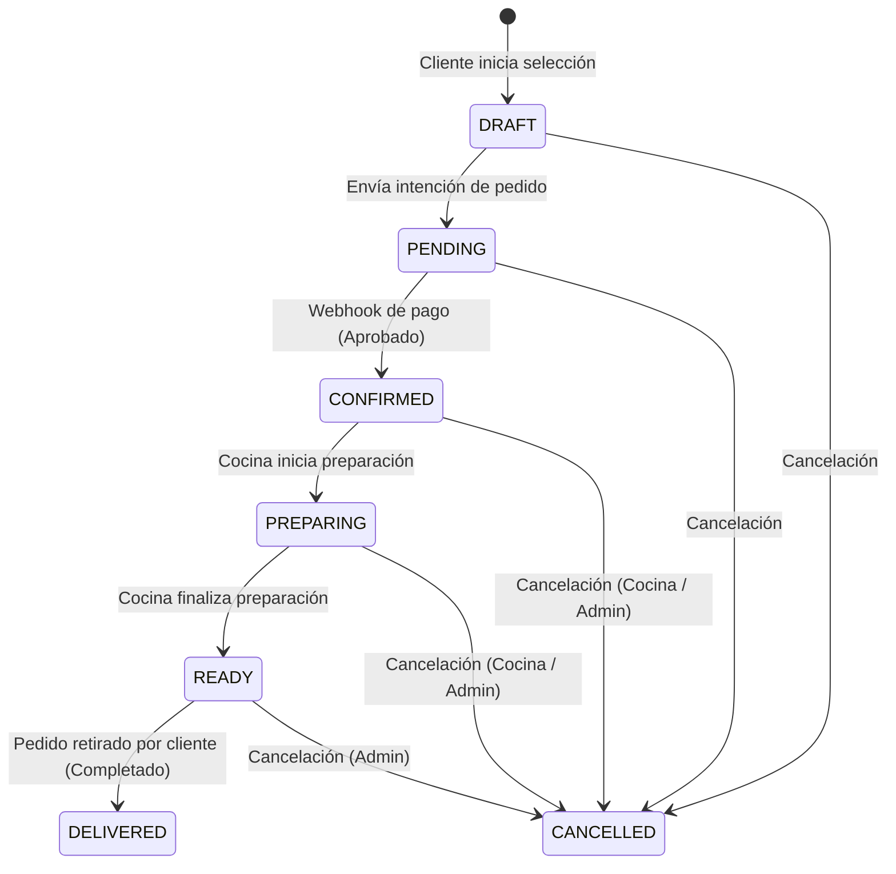

# Flujo Operativo de Cocina (KDS) — SATEM Food Engine

Este documento describe el flujo de estados en la preparación de pedidos y las transiciones operacionales en el Kitchen Display System (KDS), asegurando la integridad del proceso y evitando saltos de estado inválidos.

---

## 1. Diagrama de Transición de Estados

### Tabla de Equivalencias Semánticas

| Estado en Base de Datos (`OrderStatus`) | Término Operacional (KDS)        | Estado en Interfaz de Cliente |
| --------------------------------------- | -------------------------------- | ----------------------------- |
| `DRAFT`                                 | Borrador                         | Creado                        |
| `PENDING`                               | Pendiente de Pago                | Por Pagar                     |
| `CONFIRMED`                             | Nuevo / Pendiente de Preparación | Pagado                        |
| `PREPARING`                             | En Preparación                   | En Cocina                     |
| `READY`                                 | Listo                            | Listo                         |
| `DELIVERED`                             | Entregado / Completado           | Entregado                     |
| `CANCELLED`                             | Cancelado                        | Cancelado                     |

---

## 2. Reglas de Transición Operacionales

1. **Sin saltos de estado:** Un pedido no puede ser marcado como "Listo" (`READY`) si no ha pasado por el estado "Confirmado" (`CONFIRMED`) o "En Preparación" (`PREPARING`). Asimismo, no puede ser marcado como "Entregado" (`DELIVERED`) si no se encuentra en estado "Listo" (`READY`).
2. **Independencia del Pago:** `Order.status` progresa de forma lineal tras la confirmación de pago (`Payment.status === 'PAID'`). Las decisiones de reembolso o fallas se manejan a nivel del servicio de pago y cancelan la orden si el pago falla o se devuelve.
3. **Control Centralizado:** Todas las modificaciones del ciclo de vida del pedido deben coordinarse a través de `OrderService` para aplicar de forma consistente las reglas de negocio globales y auditoría.
