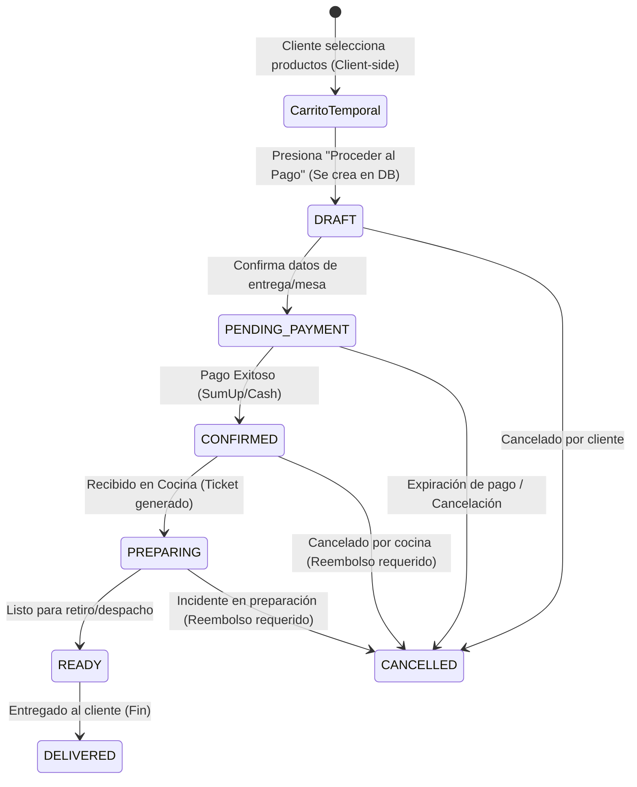

# Flujo de Pedidos — Diseño Funcional y Técnico

> **Documento de Arquitectura — Fase 4**  
> Autor: Software Architect · Fecha: 2026-07  
> Estado: ✅ **Aprobado**

---

## 1. Ciclo de Vida del Pedido

El ciclo de vida del pedido gestiona la interacción desde la selección inicial del producto por el cliente hasta la entrega final y el cierre contable de la orden.



### Detalle de las Etapas:

1. **Cliente inicia pedido / Carrito temporal:**
   - Ocurre enteramente en el lado del cliente (Client-side) mediante `localStorage` o estado local de React.
   - **Beneficio:** Evita escrituras constantes en la base de datos por adición/remoción de productos, mejorando el rendimiento y reduciendo el costo operacional de la BD.
2. **Draft Order (Pedido Borrador):**
   - Se crea en la base de datos únicamente cuando el cliente decide hacer checkout (avanzar a ingresar datos de contacto/mesa).
   - Tiene estado `DRAFT`.
3. **Confirmación / Pago Pendiente:**
   - Una vez el cliente ingresa su mesa o método de entrega, la orden pasa a `PENDING` (a la espera de confirmación de pago).
   - Si el método de pago es electrónico (ej. SumUp), el pedido espera la confirmación del webhook de pago.
4. **Pago Confirmado / Pedido Confirmado:**
   - La confirmación del pago cambia la propiedad `PaymentStatus` a `PAID` e inicia la transición a `CONFIRMED` en `OrderStatus`.
   - Si el método es efectivo (Cash), un empleado puede marcar la orden como `CONFIRMED` manualmente (con pago pendiente de cobro final en caja).
5. **Preparación Cocina:**
   - Al confirmarse, el pedido genera automáticamente una comanda en `KitchenService` y pasa a `PREPARING`.
6. **Listo para Retiro:**
   - La cocina termina el pedido, marcando el ticket como listo. El pedido pasa a `READY`.
7. **Entregado:**
   - Se entrega el pedido al cliente (o mesa). El pedido pasa a `DELIVERED` (estado final exitoso).
8. **Cancelado:**
   - El pedido se cancela en cualquier etapa previa a la entrega (estado `CANCELLED`). Si estaba pagado, gatilla un evento de reembolso.

---

## 2. Definición de Estados (Enums Decoplados)

### Propuesta de Estados de Pedido (`OrderStatus`)

Sugerimos mantener desacoplados el estado del pedido y el estado de su pago. Esto es un estándar DDD que permite flexibilidad para modelos de negocio futuros (como pago al final en mesa, propinas posteriores o transacciones fallidas que no cancelan la preparación).

```prisma
enum OrderStatus {
  DRAFT        // Borrador creado al ir al checkout (editable)
  PENDING      // Creado y validado, en espera de pago o aprobación manual
  CONFIRMED    // Aprobado para preparación (inmutable en contenido de productos)
  PREPARING    // En cocina
  READY        // Listo para entrega
  DELIVERED    // Entregado con éxito al cliente (Fin)
  CANCELLED    // Cancelado (con razón de cancelación obligatoria)
}
```

### Estados de Pago (`PaymentStatus`)

Viven en la entidad `Payment` asociada 1-a-1 al pedido:

```prisma
enum PaymentStatus {
  PENDING      // Iniciado, esperando transacción
  PROCESSING   // Transacción en proceso por pasarela (ej: 3DSecure)
  PAID         // Completado y verificado con éxito
  FAILED       // Rechazado o fallido
  REFUNDED     // Devuelto al cliente
}
```

> **Justificación Arquitectónica:**  
> Si usáramos estados acoplados como `PENDING_PAYMENT` y `PAID` en `OrderStatus`, no podríamos soportar escenarios como **"consumir en mesa y pagar al final"** (donde el pedido está en preparación/entregado pero el pago sigue pendiente). Separando ambos estados, el sistema escala de forma natural a cualquier modelo de negocio (Food Trucks con pago previo, o restaurantes tradicionales con pago posterior).

---

## 3. Matriz de Responsabilidades

| Servicio               | Responsabilidad Principal                                                                              | Interacciones Clave                                                                     |
| ---------------------- | ------------------------------------------------------------------------------------------------------ | --------------------------------------------------------------------------------------- |
| **`OrderService`**     | Orquestar el estado de la orden, validar reglas de negocio de compra, y congelar snapshots de precios. | Llama a `ProductService` para validar stock/precios, y a `KitchenService` al confirmar. |
| **`PaymentService`**   | Integrarse con la pasarela (SumUp), registrar pagos, confirmar firmas digitales de webhooks.           | Cambia el estado del `Payment` y notifica a `OrderService` del éxito/fallo.             |
| **`KitchenService`**   | Crear comandas físicas/digitales y gestionar el flujo dentro de cocina.                                | Transiciona el pedido a `PREPARING` y `READY`.                                          |
| **`ProductService`**   | Validar la existencia de ítems, su disponibilidad actual y los modificadores correspondientes.         | Es consultado por `OrderService` antes de consolidar el `DRAFT`.                        |
| **`InventoryService`** | Gestionar existencias de insumos e ingredientes.                                                       | Descuenta el stock de materias primas cuando la orden pasa a `CONFIRMED`.               |

---

## 4. Estrategia de Snapshot (Inmutabilidad del Pedido)

Para evitar la pérdida de consistencia financiera si el restaurante cambia el menú o elimina productos del catálogo, se aplica el **Snapshot Pattern**.

### Implementación en la Estructura de Datos:

1. **`OrderItem`**:
   - `name`: Almacena el nombre del producto + variante en formato de texto (ej. "MCI Burger Clásica (Doble)").
   - `unitPrice`: Decimal fijo que representa el precio neto del `MenuItem` al momento de comprar.
   - `subtotal`: Precio unitario por cantidad, sumando los modificadores.
2. **`OrderItemModifier`**:
   - `name`: Nombre del modificador elegido (ej. "Tocino Extra").
   - `priceExtra`: Cargo adicional congelado (ej. `1000.00`).

> [!IMPORTANT]
> Una vez que la orden pasa a estado `PENDING` o posterior, la aplicación **nunca** recalculará los precios basándose en el catálogo actual (`MenuItem`). Toda consulta de totales leerá exclusivamente los campos congelados de `OrderItem` y `OrderItemModifier`.

---

## 5. Estrategia de Carrito Inicial (Client-Side)

### ¿Por qué mantener el Carrito en el Cliente (Client-Side)?

1. **Cero impacto en Base de Datos:** Los clientes agregan, eliminan y modifican cantidades constantemente mientras deciden. Persistir esto en BD generaría miles de escrituras muertas.
2. **Idempotencia y Desconexión:** El cliente puede navegar con conexiones inestables (común en Food Trucks) sin perder su carrito.
3. **Checkout Simple:** El carrito se envía completo en una sola transacción `POST /api/orders` para crear el pedido en estado `DRAFT`.

---

## 6. Validación del Modelo Prisma Actual

El modelo Prisma definido en `prisma/schema.prisma` **soporta correctamente este flujo sin necesidad de modificaciones estructurales en esta fase**, dado que ya cuenta con:

- Campo `status` de tipo `OrderStatus` desacoplado.
- Modelo `Payment` con su propio `PaymentStatus`.
- Campos de auditoría histórica en `OrderItem` y `OrderItemModifier` (`name`, `unitPrice`, `priceExtra`) listos para el Snapshot Pattern.
- Relación opcional con `Customer` (permite guest checkout).

---

## 7. Reglas de Negocio a Implementar en el Código

1. **Restricción de Disponibilidad:** No se permite agregar un `menuItemId` al carrito si `isAvailable = false` o si tiene un registro activo en `deletedAt` (soft-delete).
2. **Coherencia de Precios:** El servidor volverá a validar los precios enviados por el cliente contra el catálogo activo en el momento de crear el `DRAFT` para evitar manipulaciones maliciosas de precios en el cliente.
3. **Inmutabilidad Post-Pago:** Una vez el pedido tenga `PaymentStatus = PAID` o `OrderStatus = CONFIRMED`, cualquier intento de agregar, cambiar o remover ítems arrojará un `ValidationError` o `ConflictError`.
4. **Mutación Segura:** Ninguna API o componente React modificará tablas directamente. Todas las operaciones de creación, adición, cambio de estado y cancelación serán invocadas mediante métodos en `OrderService` para asegurar auditoría y ejecución de eventos colaterales.

---

## 8. Eventos de Dominio (Preparación Conceptual)

Aunque el Event Bus no será codificado en esta fase, la capa de servicios de dominio está diseñada para lanzar conceptualmente los siguientes eventos clave ante transiciones de estado:

- **`OrderCreatedEvent`**: Se dispara cuando el pedido borrador pasa a `PENDING` (confirmando datos del cliente/mesa). Permite notificar a los sistemas de pagos externos.
- **`OrderPaidEvent`**: Se dispara cuando `PaymentStatus` cambia a `PAID` e inicia la transición a `CONFIRMED`. Despierta a `KitchenService` para generar la comanda y a `InventoryService` para descontar insumos.
- **`OrderCancelledEvent`**: Se dispara ante la cancelación del pedido. Si estaba en cocina, detiene el ticket. Si estaba pagado, gatilla el flujo de reembolso en `PaymentService`.
- **`OrderReadyEvent`**: Se dispara cuando la cocina finaliza la preparación. Permite enviar notificaciones automáticas (SMS, WhatsApp o avisador en pantalla) al cliente o repartidor.

---

## 9. Identificación de Pedidos: ID Interno vs. Número Visible

Para un control óptimo de cara al cliente y al personal, diferenciamos dos identificadores:

1.  **ID Interno (PK de base de datos)**:
    - Generado automáticamente como un `CUID` en el backend (ej. `clx294mdj00003b5y1d9v13d7`).
    - Utilizado para todas las relaciones en la base de datos, URLs internas y APIs seguras.
2.  **Número de Pedido Visible (`orderNumber`)**:
    - Generado de forma secuencial y legible por local (ej. `#001`, `#002`, `#042`).
    - Mostrado en la pantalla de cocina, tickets impresos, mensajes al cliente y detalles del carrito.
    - La generación de este número debe ser atómica en el repositorio para evitar duplicaciones bajo alta concurrencia.
