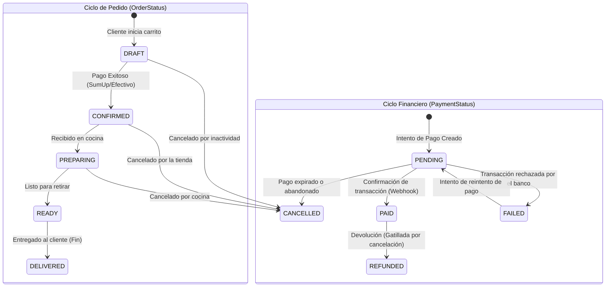
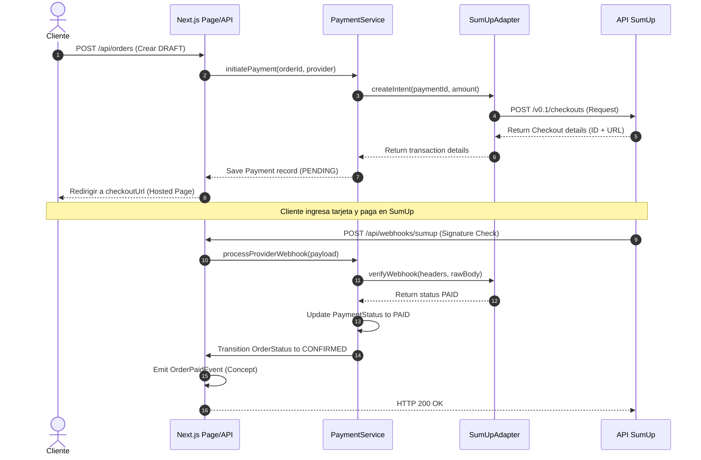

# Arquitectura de Pagos — Diseño Funcional y Técnico

> **Documento de Arquitectura — Fase 5**  
> Autor: Software Architect · Fecha: 2026-07  
> Estado: ✅ **Aprobado**

---

## 1. Máquina de Estados de Pedido y Pago (Desacoplados)

Para un control limpio y flexible de los pedidos y sus cobros, aprobamos la máquina de estados propuesta que mantiene independientes el ciclo operativo de cocina/entrega y el ciclo financiero del cobro.



### Tabla de Transición Cruzada (Eventos Clave)

| Evento Gatillador             | Estado Pedido Inicial     | Estado Pedido Final | Estado Pago Inicial | Estado Pago Final | Acción Colateral                                         |
| ----------------------------- | ------------------------- | ------------------- | ------------------- | ----------------- | -------------------------------------------------------- |
| **Iniciar checkout**          | `DRAFT`                   | `DRAFT`             | `-`                 | `PENDING`         | Se crea el Payment Intent en pasarela.                   |
| **Pago verificado** (Webhook) | `DRAFT`                   | `CONFIRMED`         | `PENDING`           | `PAID`            | Dispara `OrderPaidEvent` → Genera comanda en cocina.     |
| **Pago fallido**              | `DRAFT`                   | `DRAFT`             | `PENDING`           | `FAILED`          | El cliente puede editar su carrito o reintentar el pago. |
| **Pago expirado**             | `DRAFT`                   | `CANCELLED`         | `PENDING`           | `CANCELLED`       | Libera stock o mesas si corresponde.                     |
| **Devolución de orden**       | `CONFIRMED` / `PREPARING` | `CANCELLED`         | `PAID`              | `REFUNDED`        | Ejecuta solicitud de reembolso en la API del proveedor.  |

---

## 2. Independencia del Proveedor (Dependency Inversion)

Para evitar el acoplamiento directo de la lógica de negocio con las librerías o APIs propietarias de SumUp, diseñamos el módulo de pagos siguiendo los principios **SOLID**.

```
  Capa de Dominio (Services)
        [OrderService]
              │
        [PaymentService] ───> Usa
              │
        [IPaymentProvider] (Interface)
              │
  ─────────────────────────────────────── Límite de Integración
  Capa de Infraestructura (Adapters)
              │
        [SumUpAdapter] ───> Implementa IPaymentProvider
```

### Contrato del Proveedor (`IPaymentProvider`):

```typescript
export interface CreatePaymentIntentResult {
  providerTransactionId: string
  checkoutUrl: string // URL de redirección para pasarela externa (Hosted Checkout)
  rawPayload: Record<string, unknown>
}

export interface WebhookVerificationResult {
  isValid: boolean
  paymentId: string
  providerTransactionId: string
  amount: number
  status: 'PAID' | 'FAILED' | 'REFUNDED'
}

export interface IPaymentProvider {
  /** Crea una transacción de pago en la pasarela externa */
  createIntent(
    paymentId: string,
    amount: number,
    currency: string
  ): Promise<CreatePaymentIntentResult>

  /** Verifica la firma y estructura del webhook de la pasarela */
  verifyWebhook(
    headers: Record<string, string>,
    rawBody: string
  ): Promise<WebhookVerificationResult>

  /** Sincroniza de forma activa el estado contra la API externa (Polling/Fallback) */
  fetchStatus(providerTransactionId: string): Promise<'PAID' | 'FAILED' | 'PENDING'>

  /** Solicita el reembolso de una transacción cobrada */
  refund(providerTransactionId: string, amount: number): Promise<boolean>
}
```

---

## 3. Ciclo de Pago Detallado



### Detalle de las Etapas:

1. **Creación del Payment Intent:**
   - Al hacer checkout, `PaymentService` llama al adaptador para registrar el intento de cobro en SumUp.
   - SumUp retorna un token de checkout y una URL de redirección.
   - El backend de Next.js responde con la URL para que la UI redirija al cliente a la pasarela segura.
2. **Validación del Webhook:**
   - La pasarela envía un webhook HTTPS asíncrono al endpoint `/api/webhooks/sumup`.
   - Se valida la firma criptográfica del webhook contra el token compartido (`SUMUP_WEBHOOK_SECRET`) para evitar suplantaciones.
3. **Actualización de Estados:**
   - Tras validarse, `PaymentStatus` pasa a `PAID`.
   - El `OrderService` transiciona el pedido a `CONFIRMED`.
4. **Emisión conceptual de `OrderPaidEvent`:**
   - Se lanza este evento de dominio para notificar a la cocina (`KitchenService`) para generar comandas y a inventario (`InventoryService`) para descontar stock.

---

## 4. Campos Futuros en schema.prisma (Preparación Conceptual)

Para soportar flujos de retiro eficientes y comunicación en tiempo real en futuras fases, documentamos la estructura de los campos `PickupCode` y `EstimatedReadyTime`.

### Modelo Order (Propuesta de Campos)

```prisma
model Order {
  // ... campos actuales ...

  /// Código corto atómico de 4 dígitos para entrega (ej. "A42", "7392")
  /// Generado en el evento OrderPaidEvent
  pickupCode         String?     @db.VarChar(10)

  /// Hora estimada en que el pedido estará listo para retiro (cocinado)
  /// Calculada en el momento de la confirmación (ej: confirmedAt + 15 mins)
  estimatedReadyTime DateTime?

  // ...
  @@index([locationId, pickupCode])
}
```

- **PickupCode (Código de Retiro):**  
  Un identificador numérico o alfanumérico corto y secuencial diario. Evita exponer el CUID largo en pantallas públicas de entrega o al llamarlo por parlante.
- **EstimatedReadyTime (Tiempo Estimado):**  
  Establece la expectativa de tiempo de espera del cliente, disminuyendo la congestión en el mostrador del Food Truck o local. Puede calcularse sumando un búfer de preparación estándar de la sucursal o según la carga actual de trabajo de la cocina.

---

## 5. Entidad Conceptual PaymentAttempt (Multi-intentos)

Para evitar la pérdida del historial de transacciones fallidas de un cliente, documentamos el diseño conceptual de la entidad `PaymentAttempt`.

### Justificación:

Actualmente, si un cliente falla tres transacciones y luego paga con éxito en la cuarta, sobrescribir el campo de pago original oculta la tasa de fallo de la pasarela y dificulta la auditoría financiera. En fases futuras, introduciremos la relación 1-a-N:
`Payment 1 ───> N PaymentAttempt`

```prisma
model PaymentAttempt {
  id                   String        @id @default(cuid())
  paymentId            String
  providerTransactionId String       @unique
  amount               Decimal       @db.Decimal(10, 2)
  status               PaymentStatus @default(PENDING)
  errorMessage         String?       @db.Text
  rawPayload           Json?
  createdAt            DateTime      @default(now())
  updatedAt            DateTime      @updatedAt

  payment              Payment       @relation(fields: [paymentId], references: [id])
}
```

Esto permitirá registrar de manera granular cada transacción individual, manteniendo el registro padre `Payment` como el consolidado del estado financiero de la orden.

---

## 6. Decisiones Arquitectónicas Mandatorias de Implementación

1.  **Idempotencia en Webhooks (`PaymentService.processProviderWebhook`)**:
    - Si se recibe el mismo webhook repetidamente (reintentos de la pasarela ante latencias), el servicio verificará si la transacción ya está en estado final (`PAID`, `FAILED` o `REFUNDED`).
    - Si ya fue procesada, omitirá la ejecución de lógica secundaria y retornará inmediatamente el registro existente sin duplicar eventos de dominio.
2.  **Aislamiento del Webhook**:
    - El webhook interactuará **exclusivamente** para actualizar el `PaymentStatus` y gatillar conceptualmente el `OrderPaidEvent`.
    - Bajo ningún caso el webhook invocará de forma directa a servicios de cocina (`KitchenService`) o inventario (`InventoryService`). El desacoplamiento se delega al evento del dominio.
3.  **Respuesta Enriquecida de Checkout (`initiatePayment`)**:
    - La firma del método en el controlador e integraciones retornará un objeto enriquecido:
      - `orderNumber`: Código amigable de pedido (ej: `#001`).
      - `checkoutUrl`: Enlace provisto por el adaptador de SumUp.
      - `expiresAt`: Fecha de vencimiento del intento (si el proveedor lo facilita).
      - `estimatedPreparationTime`: Tiempo estimado de cocinado en minutos (ej: `15`), calculado según parámetros del negocio.
