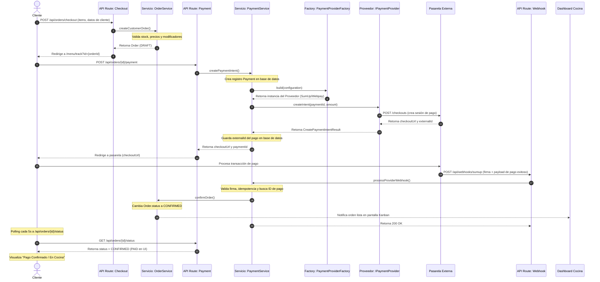

# Flujo Comercial de Integración de Pagos — SATEM Food Engine

Este documento define la secuencia end-to-end y la arquitectura para el procesamiento de pagos reales y mockeados en SATEM Food Engine, garantizando el aislamiento de responsabilidades y la idempotencia del linter de transacciones.

---

## 1. Diagrama de Secuencia

---

## 2. Aislamiento de Capas y Multi-Tenancy

1. **Resolución de Configuración:** `ITenantConfigurationRepository` resuelve la prioridad de credenciales del local comercial:
   `Location.paymentProvider → Organization.paymentProvider → process.env → SUMUP`.
2. **Factory Desacoplada:** `PaymentProviderFactory` recibe la configuración Json resuelta y construye la instancia del proveedor inyectándole el payload. Nunca realiza consultas a la base de datos de Prisma directamente.
3. **Idempotencia:** El `PaymentService` realiza una validación de estado del pago (`PAID`, `FAILED`, `REFUNDED`) antes de aplicar transiciones sobre el pedido, protegiendo al backend de re-procesamientos por reintentos de red del webhook.
